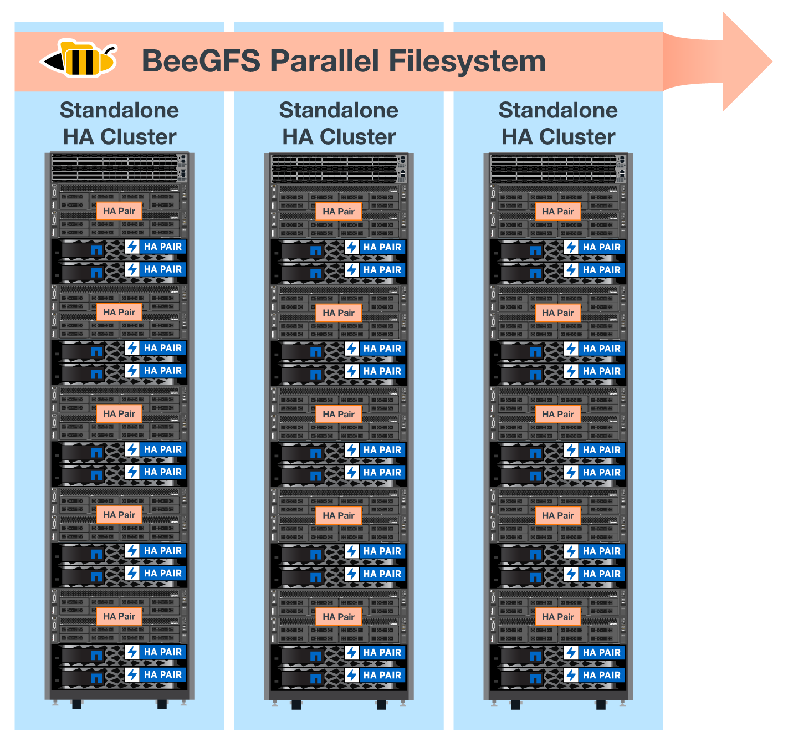

= アーキテクチャの概要
:hardbreaks:
:allow-uri-read: 
:nofooter: 
:icons: font
:linkattrs: 
:imagesdir: ./media/

[role="lead"]
NetApp解決策 のBeeGFSには、検証済みのワークロードをサポートするために必要な機器、ケーブル配線、構成を決定するためのアーキテクチャ設計に関する考慮事項が含まれます。

== ビルディングブロックアーキテクチャ

BeeGFSファイルシステムは、ストレージ要件に応じてさまざまな方法で導入および拡張できます。たとえば、主に多数の小さなファイルを扱うユースケースでは、メタデータのパフォーマンスと容量を強化できますが、大容量ファイルが少ないユースケースでは、実際のファイル内容よりも多くのストレージ容量とパフォーマンスを優先的に使用できます。このような複数の考慮事項は並列ファイルシステム環境のさまざまな次元に影響するため、ファイルシステムの設計と導入が複雑になります。

このような課題に対応するために、ネットアップでは、これらの要素のそれぞれをスケールアウトするための標準的なビルディングブロックアーキテクチャを設計しました。通常、BeeGFSビルディングブロックは、次の3つの設定プロファイルのいずれかに配置されます。

* BeeGFSの管理、メタデータ、ストレージサービスなど、単一のベースとなるビルディングブロックです
* BeeGFSメタデータとストレージビルディングブロック
* BeeGFSストレージのみのビルディングブロック

これらの3つのオプション間のハードウェア変更は、BeeGFSメタデータに小さいドライブを使用することだけです。それ以外の場合は、すべての設定変更がソフトウェアを介して適用されます。また、導入エンジンとしてAnsibleを使用することで、特定のビルディングブロックに必要なプロファイルを設定することで、構成タスクを簡単に実行できます。

詳細については、を参照してください <<ハードウェアの設計を確認した>>。

== ファイルシステムサービス

BeeGFSファイルシステムには、次の主要サービスが含まれます。

* *管理サービス。*その他すべてのサービスを登録および監視します。
* *ストレージ・サービス。*データ・チャンク・ファイルと呼ばれる分散ユーザー・ファイルの内容を保存します。
* *メタデータサービス。*ファイルシステムのレイアウト、ディレクトリ、ファイル属性などを追跡します。
* *クライアント・サービス。*保存されたデータにアクセスするためのファイル・システムをマウントします。

次の図は、NetApp Eシリーズシステムで使用されるBeeGFS解決策 のコンポーネントと関係を示しています。

image:../media/beegfs-components.png[""]

BeeGFSは、並列ファイルシステムとして、複数のサーバノードを介してファイルをストライプ化することで、読み取り/書き込みのパフォーマンスと拡張性を最大化します。サーバノードは連携して動作するため、ほかのサーバノード（一般に_clients__）から同時にマウントしてアクセスすることができる単一のファイルシステムを提供します。これらのクライアントは、分散ファイルシステムをNTFS、XFS、ext4などのローカルファイルシステムと同様に認識して使用できます。

これら4つの主要サービスは、サポートされている幅広いLinuxディストリビューションで動作し、InfiniBand（IB）、Omni-Path（OPA）、RDMA over Converged Ethernet（RoCE）など、すべてのTCP/IPまたはRDMA対応ネットワークを介して通信します。BeeGFSサーバサービス（管理'ストレージ'メタデータ）はユーザ空間デーモンであり'クライアントはネイティブカーネルモジュール（パッチレス）ですすべてのコンポーネントは、リブートせずにインストールまたは更新でき、同じノード上で任意の組み合わせのサービスを実行できます。

== ノードを確認しました

NetApp解決策 上のBeeGFSには、NetApp EF600ストレージシステム（ブロックノード）とLenovo ThinkSystem SR665サーバ（ファイルノード）という検証済みノードが含まれています。

=== ブロックノード：EF600ストレージシステム

NetApp EF600オールフラッシュアレイは、あらゆる数のワークロードを同時にサポートしながら、データへの一貫したほぼリアルタイムアクセスを提供します。EF600ストレージシステムは、データをAIアプリケーションやHPCアプリケーションに高速かつ継続的にフィードできるように、キャッシュされた最大200万IOPS、100マイクロ秒未満の応答時間、42GBpsのシーケンシャル読み取り帯域幅を1つのエンクロージャ内に提供します。

=== ファイルノード：Lenovo ThinkSystem SR665 Server

SR665は、PCIe 4.0を搭載した2ソケット2Uサーバです。この解決策 の要件を満たすように構成すると、直接接続されたEシリーズノードが提供するスループットとIOPSの可用性とバランスの取れた構成でBeeGFSファイルサービスを実行するための十分なパフォーマンスが得られます。

Lenovo SR665の詳細については、を参照してください https://lenovopress.com/lp1269-thinksystem-sr665-server["LenovoのWebサイト"^]。

== ハードウェアの設計を確認した

このソリューションのビルディングブロック（次の図を参照）では、BeeGFSファイルレイヤに2台のデュアルソケットPCIe 4.0対応サーバを使用し、ブロックレイヤとして2台のEF600ストレージシステムを使用します。

image:../media/beegfs-design-image2-small.png[""]

NOTE: 各ビルディングブロックには2つのBeeGFSファイルノードが含まれるため、フェイルオーバークラスタでクォーラムを確立するには少なくとも2つのビルディングブロックが必要です。2ノードクラスタを構成することもできますが、この構成にはフェイルオーバーの正常な実行を妨げる可能性がある制限があります。2ノードクラスタが必要な場合は、Tiebreakerとして第3のデバイスを組み込むことができます（ただし、この設計はこのサイトでは説明しません）。

各ビルディングブロックは、ファイルレイヤとブロックレイヤのフォールトドメインを分離する2層ハードウェア設計によって高可用性を実現します。各階層は個別にフェイルオーバーできるため、耐障害性が向上し、障害が連鎖的に発生するリスクを軽減できます。HDR InfiniBandとNVMeOFを併用することで、ファイルノードとブロックノードの間のスループットが向上し、レイテンシが最小限に抑えられます。また、完全な冗長性と十分なリンクのオーバーサブスクリプション機能を備えているため、システムが部分的に劣化している場合でも、分離型設計がボトルネックにならないよう

NetApp解決策 のBeeGFSは、導入環境のすべてのビルディングブロックで実行されます。最初に導入したビルディングブロックでは、BeeGFS管理、メタデータ、ストレージの各サービス（基本ビルディングブロックと呼ばれます）を実行する必要があります。以降のすべてのビルディングブロックは、BeeGFSメタデータとストレージサービスを実行するソフトウェアまたはストレージサービスのみを使用して構成されます。ビルディングブロックごとに異なる構成プロファイルを使用できるため、基盤となる同じハードウェアプラットフォームとビルディングブロック設計を使用して、ファイルシステムのメタデータやストレージ容量、パフォーマンスを拡張できます。

最大5つのビルディングブロックがスタンドアロンのLinux HAクラスタに統合され、クラスタリソースマネージャ（Pacemaker）ごとに適正な数のリソースを確保し、クラスタメンバーの同期を維持するために必要なメッセージングのオーバーヘッド（Corosync）を削減します。最低2つのビルディングブロックをクラスタごとに用意して、十分な数のメンバーがクォーラムを確立できるようにすることを推奨します。これらのスタンドアロンBeeGFS HAクラスタの1つ以上を組み合わせて、クライアントが単一のストレージネームスペースとしてアクセスできるBeeGFSファイルシステムを作成します（次の図を参照）。

最終的にはラックあたりのビルディングブロック数は、特定のサイトの電力および冷却要件によって決まりますが、 解決策 は、1台の42Uラックに最大5個のビルディングブロックを導入できるように設計されていますが、ストレージ/データネットワークに使用する1U InfiniBandスイッチを2台収容するスペースがあります。各ビルディングブロックには8つのIBポート（冗長性のためにスイッチごとに4つ）が必要です。したがって、5つのビルディングブロックが40ポートHDR InfiniBandスイッチ（NVIDIA QM8700など）上の半分のポートを残して、脂肪ツリーまたは類似の非ブロッキングトポロジを実装できます。この構成により、ネットワークのボトルネックを発生させることなくストレージラックまたはコンピューティング/ GPUラックの数をスケールアップできます。オプションで、オーバーサブスクライブされたストレージファブリックをストレージファブリックベンダーの推奨事項で使用できます。

次の図は、80ノードのファットツリートポロジを示しています。

image:../media/beegfs-design-image4.png[""]

Ansibleを導入エンジンとして使用してネットアップにBeeGFSを導入することで、管理者はコードの手法として最新のインフラを使用して環境全体を維持できます。これにより、複雑なシステムになる作業が大幅に簡易化されるため、管理者は設定をすべて一元的に定義して調整し、環境の規模に関係なく一貫して適用することができます。BeeGFSコレクションはから入手できます https://galaxy.ansible.com/netapp_eseries/beegfs["Ansible Galaxy"^] および https://github.com/netappeseries/beegfs/["ネットアップのEシリーズGitHub"^]。
