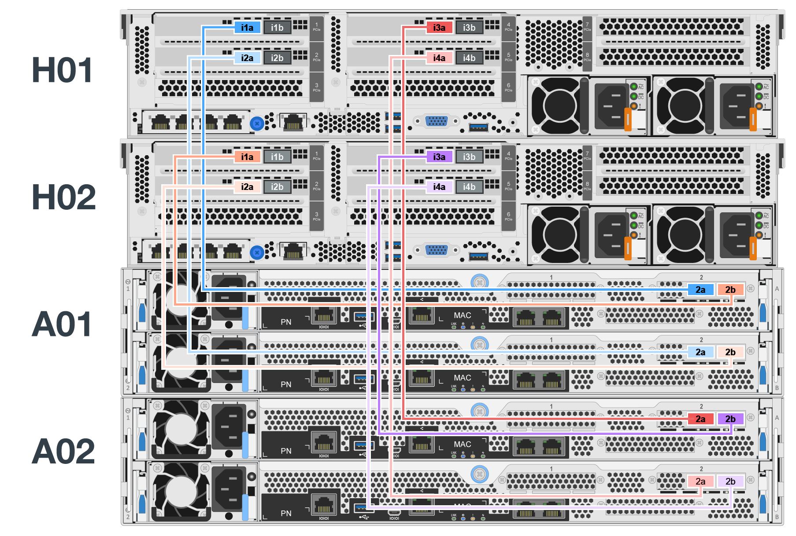

= ハードウェアを導入
:hardbreaks:
:allow-uri-read: 
:nofooter: 
:icons: font
:linkattrs: 
:imagesdir: ./media/

[role="lead"]
各ビルディングブロックは、HDR（200GB）InfiniBandケーブルを使用して2つのブロックノードに直接接続された、検証済みの2つのx86ファイルノードで構成されます。

NOTE: フェイルオーバークラスタでクォーラムを確立するには、少なくとも2つのビルディングブロックが必要です。2ノードクラスタには、フェイルオーバーの正常な実行を妨げる可能性がある制限があります。3つ目のデバイスをTiebreakerとして組み込むことで、2ノードクラスタを構成できますが、このドキュメントではその設計については説明していません。

次の手順は、特に記載がないかぎり、クラスタ内の各ビルディングブロックについて同じです。これは、このビルディングブロックを使用してBeeGFSメタデータサービスとストレージサービスの両方を実行するか、ストレージサービスだけを実行するかに関係ありません。

.手順
. で指定したモデルを使用して、4つのホストチャネルアダプタ（HCA）で各BeeGFSファイルノードをセットアップします。 link:beegfs-technology-requirements.html["技術要件"]以下の仕様に従って、HCAをファイルノードのPCIeスロットに挿入します。
+
** * Lenovo ThinkSystem SR665 V3サーバー：PCIeスロット1、2、4、5を使用します。
** * Lenovo ThinkSystem SR665サーバー：PCIeスロット2、3、5、6を使用します。

. デュアルポートの200GBホストインターフェイスカード（HIC）で各BeeGFSブロックノードを設定し、2台の各ストレージコントローラにHICを取り付けます。
+
2つのBeeGFSファイルノードがBeeGFSブロックノードの上になるようにビルディングブロックをラックに配置します。次の図は、Lenovo ThinkSystem SR665 V3サーバをファイルノードとして使用するBeeGFSビルディングブロックの正しいハードウェア構成を示しています（背面図）。

+
image:../media/buildingblock-sr665v3.png[""]

+

NOTE: 一般に、本番環境では電源装置を冗長PSUにする必要があります。

. 必要に応じて、BeeGFSブロックノードのそれぞれにドライブを取り付けます。
+
.. ビルディングブロックを使用してBeeGFSメタデータとストレージサービスを実行し、さらに小さいドライブをメタデータボリュームに使用する場合は、次の図に示すように、最も外側のドライブスロットにそれらが搭載されていることを確認します。
.. すべてのビルディングブロック構成で、ドライブエンクロージャにフル装備されていない場合は、最適なパフォーマンスを得るために、同じ数のドライブがスロット0~11および12~23に装着されていることを確認してください。
+
image:../media/driveslots.png[""]

. 次の図に示すトポロジと一致するように、を使用してブロックノードとファイルノードを接続します link:beegfs-technology-requirements.html#block-file-cables["1M InfiniBand HDR 200GB直接接続銅ケーブル"]。
+

+

NOTE: 複数のビルディングブロックを横断するノードが直接接続されることはありません。各ビルディングブロックはスタンドアロンユニットとして扱われ、ビルディングブロック間のすべての通信はネットワークスイッチを介して行われます。

. InfiniBandストレージスイッチに固有のを使用して、ファイルノードの残りのInfiniBandポートをストレージネットワークのInfiniBandスイッチに接続します link:beegfs-technology-requirements.html#file-switch-cables["2M InfiniBandケーブル"] 。
+
スプリッタケーブルを使用してストレージスイッチとファイルノードを接続する場合は、スイッチから1本のケーブルが分岐し、ライトグリーンで示されているポートに接続する必要があります。別のスプリッタケーブルがスイッチから分岐し、濃い緑色で示されているポートに接続する必要があります。

+
また、冗長スイッチを使用するストレージネットワークの場合、薄い緑色のポートは1つのスイッチに接続し、濃い緑色のポートは別のスイッチに接続します。

+
image:../media/networkcable.png[""]

. 必要に応じて、同じケーブル配線ガイドラインに従って追加のビルディングブロックをアセンブルします。
+

NOTE: 1台のラックに導入できるビルディングブロックの総数は、各サイトで利用可能な電力と冷却量によって異なります。

