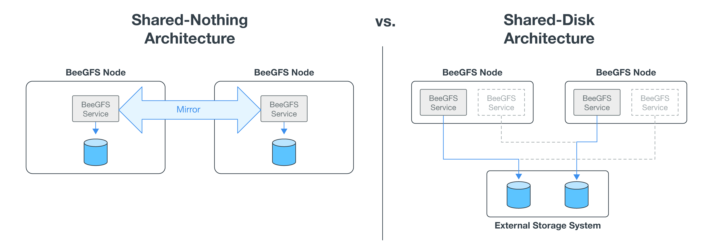

= 解決策の概要
:hardbreaks:
:allow-uri-read: 
:nofooter: 
:icons: font
:linkattrs: 
:imagesdir: ./media/

[role="lead"]
NetApp解決策 のBeeGFSは、BeeGFS並列ファイルシステムとNetApp EF600ストレージシステムを組み合わせることで、信頼性と拡張性に優れた対費用効果の高いインフラを実現し、要件の厳しいワークロードに対応します。

この設計では、最新のエンタープライズサーバおよびストレージハードウェアとネットワーク速度によって実現されるパフォーマンス密度を活用します。 デュアルAMD EPYC 7003「Milan」プロセッサを搭載し、200Gb（HDR）InfiniBandを使用して直接接続されたPCIe 4.0をサポートするファイルノードを必要とし、NVMe/IBプロトコルを使用してエンドツーエンドのNVMeおよびNVMeOFを提供するブロックノードを必要とします。

== NVAプログラム

NetApp解決策 上のBeeGFSは、NetApp Verified Architecture（NVA）プログラムの一部であり、特定のワークロードとユースケースについて、参考構成とサイジングに関するガイダンスを提供します。NVAソリューションは、導入リスクを最小限に抑え、製品化サイクルを短縮するように徹底的にテストと設計されています。

== ユースケース

以下のユースケースは、NetApp解決策 のBeeGFSに適用されます。

* 人工知能（AI）（機械学習（ML）、ディープラーニング（DL）、大規模な自然言語処理（NLP）、自然言語理解（NLU）など）詳細については、を参照してください https://www.netapp.com/blog/beefs-for-ai-fact-vs-fiction/["BeeGFS for AI：事実とフィクション"^]。
* MPI（メッセージ・パッシング・インターフェイス）やその他の分散コンピューティング技術により高速化されたアプリケーションを含む、ハイパフォーマンス・コンピューティング（HPC）。詳細については、を参照してください https://www.netapp.com/blog/beegfs-for-ai-ml-dl/["BeeGFSがHPCの枠を超えている理由"^]。
* 次の特徴を持つアプリケーションワークロード：
+
** 1GBを超えるファイルの読み取りまたは書き込み
** 複数のクライアント（10s、100s、1000s）による同じファイルの読み取りと書き込み

* 数テラバイトまたは数ペタバイトのデータセット。
* 単一のストレージネームスペースが必要な環境：大容量ファイルと小容量ファイルを混在させる場合に最適化可能です。

== 利点

ネットアップでBeeGFSを使用する主なメリットは次のとおりです。

* 検証済みハードウェア設計の可用性：ハードウェアとソフトウェアコンポーネントを完全に統合し、予測可能なパフォーマンスと信頼性を確保します。
* Ansibleを使用して導入と管理を行い、シンプルさと大規模な一貫性を実現します。
* EシリーズPerformance AnalyzerおよびBeeGFSプラグインを使用した監視と監視が可能です。詳細については、を参照してください https://www.netapp.com/blog/monitoring-netapp-eseries/["NetApp Eシリーズソリューション監視フレームワークのご紹介"^]。
* データの保持と可用性を提供する共有ディスクアーキテクチャを採用した高可用性。
* コンテナとKubernetesを使用した最新のワークロード管理とオーケストレーションをサポート詳細については、を参照してください https://www.netapp.com/blog/kubernetes-meet-beegfs/["Kubernetes BeeGFSを導入すれば、将来のニーズにも対応できる投資が実現します"^]。

== HAアーキテクチャ

BeeGFS on NetAppは、共有ディスクハイアベイラビリティ（HA）アーキテクチャを実現するネットアップハードウェアと完全に統合された解決策 を作成することで、BeeGFSエンタープライズエディションの機能を拡張します。

NOTE: BeeGFSコミュニティエディションは無料でご利用いただけますが、エンタープライズエディションにはネットアップなどのパートナーからプロフェッショナルサポートサブスクリプション契約を購入する必要があります。エンタープライズエディションでは、耐障害性、クォータの適用、ストレージプールなど、いくつかの追加機能を使用できます。

次の図は、シェアードナッシングおよび共有ディスクHAアーキテクチャの比較です。

詳細については、を参照してください https://www.netapp.com/blog/high-availability-beegfs/["ネットアップがサポートするBeeGFSの高可用性についてお知らせします"^]。

== Ansible

ネットアップのBeeGFSは、Ansible Automationを使用して提供および導入されます。この自動化はGitHubとAnsible Galaxy（BeeGFSコレクションはから入手できます https://galaxy.ansible.com/netapp_eseries/beegfs["Ansible Galaxy"^] および https://github.com/netappeseries/beegfs/["ネットアップのEシリーズGitHub"^]）。Ansibleは、主にBeeGFSビルディングブロックの構築に使用するハードウェアでテストされますが、サポートされているLinuxディストリビューションを使用して、ほぼすべてのx86ベースのサーバで実行するように設定できます。

詳細については、を参照してください https://www.netapp.com/blog/deploying-beegfs-eseries/["Eシリーズストレージを使用したBeeGFSの導入"^]。
